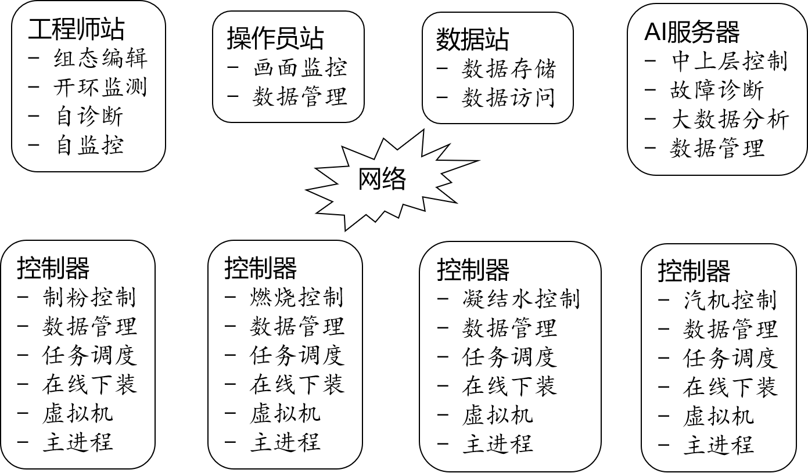
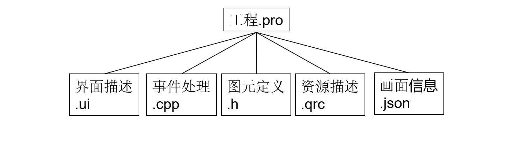
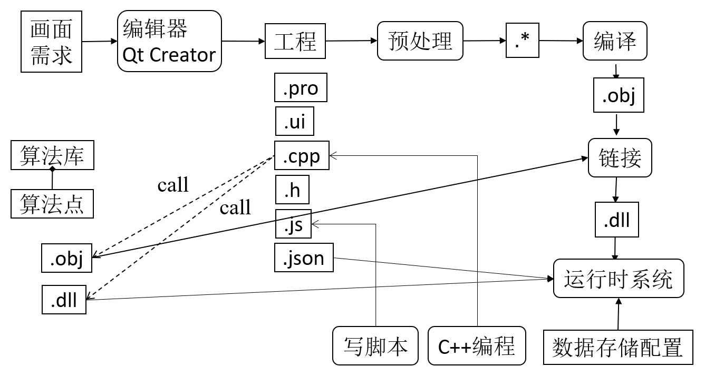
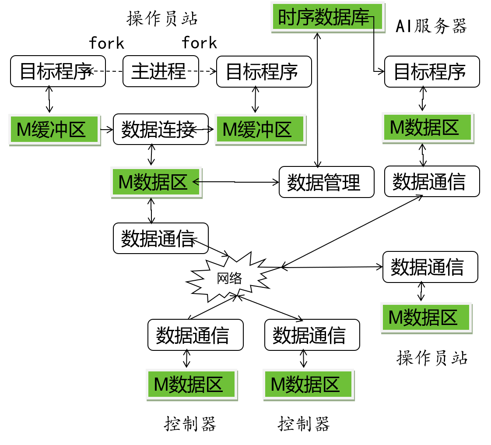
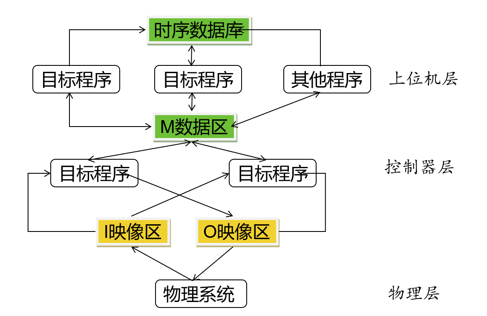
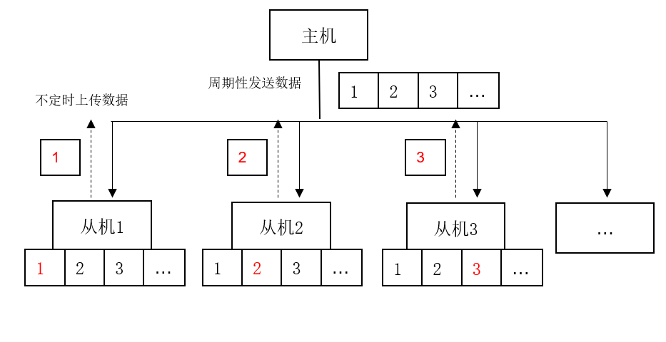
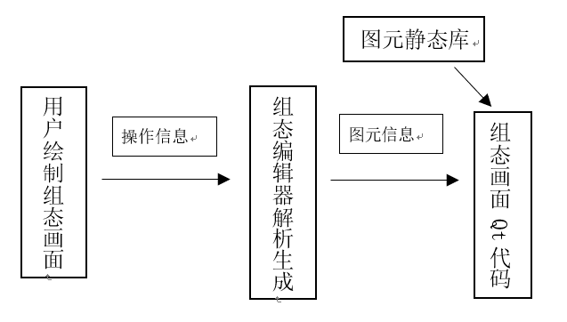
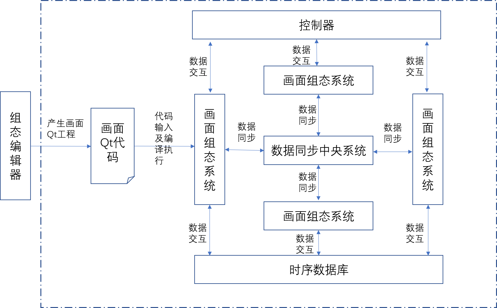

## 组态软件系统结构
&emsp;&emsp;电厂分散控制集中管理系统的构成：

## 软件系统编译

&emsp;&emsp;工程由工程描述文件（.pro文件）、C++代码（.cpp和.h文件）、XML文档（.ui文件）、JS代码（.js文件和.qrc文件）、JSON文件组成，描述了一个源程序的全部。.pro文件对工程进行了整体描述，包括工程中包含的文件组成和被编译时所需要的必要信息，如所使用的Qt内部库、目标二进制代码存放路径等。C++代码用于表达控件和事件处理，并对使用的数据点进行了抽象的描述，当画面代码被编译并由运行时系统加载时，抽象描述被转化为实际数据内存访问。XML文档用于描述和展示静态画面本身，包含如图元形状、大小、颜色、位置等信息。JS代码表达额外处理，与C++代码之间可以相互引用以发挥作用。JSON文件中包含画面整体及额外信息，如画面类型、创建时间、画面依赖关系等。  

&emsp;&emsp;代码输入及编译执行：利用Qt的moc编译和C++编译，生成Qt插件，用Qt插件系统加载画面代码。  
&emsp;&emsp;保证目标程序.exe文件和动态链接库文件.dll（如果需要的话），同时在目标机上，即可运行目标程序。目标机一般为操作员站。  
&emsp;&emsp;如果目标机是Windows平台，动态链接库.dll作为共享函数库的可执行文件；如果是Linux平台，动态链接库是.so；如果是其他平台，则取决于相应的支持。  
&emsp;&emsp;JS脚本引擎使用QJSEngine，由Qt完成嵌入，嵌入在运行时系统里。  

## 数据区协议与同步
&emsp;&emsp;基于缓冲区的数据连接周期性地同步同一个操作员站的M缓冲区和M数据区，以使得写一致在周期间保持，这个同步周期与下面所述的画面刷新频率一致。数据管理负责将M数据区写入时序数据库以构成历史数据，并在仿真过程中根据时序数据库周期性产生M数据区内容。各目标机内的数据通信进程负责自己机器内M数据区的周期间写一致，这个周期与上位机目标程序周期最小值一致。  
&emsp;&emsp;基于缓冲区的数据管理机制解耦了分散控制系统各目标程序，减少死锁发生概率，也提高了数据访问效率从而改善实时性。  

&emsp;&emsp;数据同步：自定义应用层协议，暂时采用tcp/ip协议。采用“数据点编号：数据点值”的格式在运行系统进程和中央同步进程之间传递数据，由中央进程统一更新数据区，定时下发数据到各运行系统。  
&emsp;&emsp;数据同步：控制器与运行系统交互数据，再由运行系统将数据上传到数据库，同样自定义应用层协议，采用“数据点编号：数据值”的格式传递数据。  
&emsp;&emsp;当整个数据区分成多块，每台机器或每个进程只能对自己区块的数据区进行写操作时，管理方式采用主从模式。每台从机连接到主机，定时向主机发送自己的数据区数据，主机进行数据区更新和记录，并周期性将数据区中有变动的数据编号及值发送给每一台从机，从机根据接收到的数据对自己的数据区进行更新。  

## 画面代码生成
&emsp;&emsp;产生画面Qt工程：有事先编译成静态库的Qt图元代码为基础，也可在原有图元上增量生成新的图元静态库。事件代码可事先在图元静态库中确定封装在图元中，也可由组态编辑器生成。具体事件类型待定。  
&emsp;&emsp;组态编辑器获取用户操作中所包含的图元相关信息，如图元类别、位置、事件等，然后由组态编辑器分别产生对应的Qt头文件、源文件等代码，将图元静态库链接进来，传递相应的参数创建图元对象，形成画面代码。  

&emsp;&emsp;基于抽象数据类型的功能块代码规格减少了智慧控制系统开发维护成本。  
&emsp;&emsp;基于代码复用的画面组态编译方法很好保证了监控画面的设计预期，如风格一致性，适应画面组态新发展。  

## 运行时系统
&emsp;&emsp;运行时系环境的功能：插件管理、数据存储、数据通信、仿真支持。运行时系统结构如下：    

&emsp;&emsp;插件管理子系统加载画面代码相关的.dll文件，读取JSON信息，检测画面依赖关系，并将画面加载到对应的显示区，再读取内存中的全局数据区变量，通过bindVar函数，将全局数据区变量传递给画面代码，画面即可正常显示运行。  
&emsp;&emsp;数据存储子系统读取数据存储配置的相关JSON文件，组合形成sql语句，以JSON文件中描述的存储周期，将内存中的全局数据区变量保存到数据库相应位置。  
&emsp;&emsp;数据通信子系统负责与外部进行数据通信及数据同步，将数据发送出去或者从外部获取数据，获取数据时以约定的通信协议解析数据，将数据保存到内存全局数据区相应的位置。  
&emsp;&emsp;仿真子系统读取数据存储配置的相关JSON文件，组合形成sql语句，依次获取时序数据库中的数据，更新到内存数据区中，从而使画面根据历史数据复现，达到仿真目的。  
&emsp;&emsp;为了让运行时系统能够确定将画面加载到具体哪一个模块（如是水泵模块还是汽轮机模块），画面代码的JSON文件中需要提供画面类型信息，用“type”标识，并约定取值为“0”时代表画面为水泵画面。此外JSON文件中还可以提供如画面依赖关系等额外约束信息，在加载画面时通过检测依赖关系，保证一定的加载顺序。在C++代码中使用Q_PLUGIN_METADATA宏将JSON文件进行元数据注册，将JSON文件内容纳入编译范畴。  
&emsp;&emsp;在C++代码中，使用Q_INTERFACES宏进行接口注册，保证实现用于变量绑定的bindVar接口函数。该函数向外提供数据绑定接口，用于和运行时系统之间以约定方式传递真实数据。一种约定方式为，事先约定各个数据点的编号，运行时系统读取画面代码中接口函数提供的数据点编号，将运行时系统内存中相应编号的数据存放地址提供给画面代码接口函数，由画面代码根据所获得的变量具体值进行显示或其他处理。bindVar接口函数的原型为virtual void bindVar (QMap<int, QVector<QString>>&)  Q_DECL_OVERRIDE，该函数接受一个QMap<int, QVector<QString>>引用类型的形参，返回值为空。QMap的键类型为int，代表数据点编号。本例中0代表水泵液面高度，1代表水泵温度。值类型为QVector<QString>，包含数据点的取值和类型等具体信息，其中QVector中索引为0的元素为数据点的值，索引为1的元素标识着数据点的类型。在运行时系统运行时，只需要将程序中的全局数据区变量global_var传递给bindVar函数，画面即可正常显示。运行时系统不断从外部接收数据点数据并更新global_var的值，画面代码通过使用Qt信号槽连接，绑定好事件及事件响应函数，再通过设置定时器，不断读取数据值更新显示，并进行数值判断，触发信号以调用事先绑定的响应函数。如某数据点数值过高触发警报代码、引起报警灯闪烁等。报警阈值可通过画面中的输入控件输入、按钮控件确认，从而改变画面代码内部用于记录报警阈值变量的值。当报警阈值变量的值改变时，触发回调函数，更新画面中该值的显示。  
&emsp;&emsp;通过使用JS脚本，可以动态改变界面外观、模块功能等，达到更强大灵活的控制效果。本例实现了使用JS脚本改变Qt代码中button对象的颜色。画面C++代码画面类包含私有成员变量m_jsEngine，变量类型为QJSEngine（Qt提供的JS引擎）。在Qt代码中通过调用m_jsEngine.globalObject().setProperty("cppButton", …)函数将.ui中的对应button对象注册为"cppButton"后，即可在JS文件中使用该变量。回到Qt代码，将完整的JS文件内容读入，并调用m_jsEngine.evaluate()函数，在JS文件中实现的对cppButton对象调色的效果便等同于对QT中相应button的操作。通过编写更复杂的JS脚本代码，能够完成更复杂的控制逻辑，从而实现更强大的控制效果。  
&emsp;&emsp;基于时序数据库的仿真系统可以重现历史画面或模拟虚拟画面，便于开发时调试与生产时追踪。  

## 运行效果
&emsp;&emsp;*效果见[demo效果演示](./demo效果演示/)*